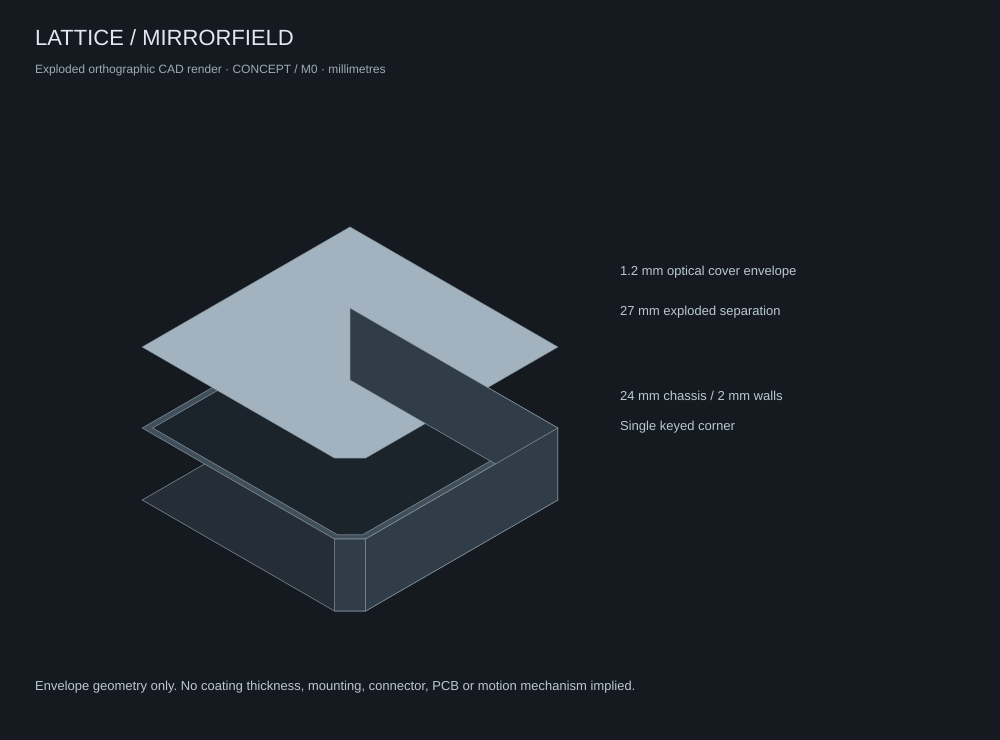

# LATTICE / MIRRORFIELD 0.5

**PHYSICAL COMPUTING FABRIC** · Authoritative industrial design specification · **CONCEPT**

The enclosure is a functional subsystem. Each surface has an optical, thermal, mechanical, sensing, or interaction responsibility. Reflective appearance must never conceal an unsafe state or replace electrical protection.

For the Signal Cube, use an overlapping mirror-scale exterior: individual shield-shaped reflective pieces, staggered rows and fine dark seams around a cubic inner volume. Integrate a distinct recessed optical band between scale rows. Avoid a computer chassis appearance, fan grilles, exposed machinery and decorative pipes. This is a concept direction; scale retention and the underlying cube structure are not production-engineered. The portal's anatomy and section explain proposed construction separately from the planar M0 dimensions below.

Product direction update: the **Signal Cube** is the central sensing and routing product. MIRRORFIELD provides surface research for that product. The user-selected [mirror-scale image](design/concepts/mirror-scale-cube.png) is its appearance reference; the [SC-A0 manufacturing brief](manufacturing/SIGNAL_CUBE_MANUFACTURING_PLAN.md) assigns sensor/PV cassettes beneath selected scales and the main hardware to an internal central core. The M0 dimensions and CAD below remain the planar array research fixture, not a cube enclosure. See [Signal Cube](docs/SIGNAL_CUBE.md) for the product boundary and implemented software lab.

## Geometry and assembly

The M0 cell envelope is 80 × 80 × 25.2 mm: 24 mm chassis and a 1.2 mm cover envelope. The chassis has 2 mm walls and floor. One 6 mm clipped corner creates a tactile orientation cue. Array pitch is 86 mm; a 4 × 4 cell arrangement spans 338 × 338 mm before a surrounding frame. These are provisional design dimensions, not a qualified motion envelope. M0 envelope tolerance target is ±0.3 mm, subject to the chosen process. Contacts, magnets, fasteners and optical tolerances require separate engineering dimensions.

See [dimensioned drawing](manufacturing/drawings/m0-envelope.svg), [CAD source](manufacturing/cad/mirrorfield-m0.scad), [chassis STL](manufacturing/cad/m0-chassis.stl), and [cover STL](manufacturing/cad/m0-cover.stl). Millimetres are assumed for STL import. CAD establishes a static envelope only; the tilting mechanism, retention, PCB, gaskets, and connector are not modeled.

## Surface zoning

| Zone | Function | Appearance | Constraint |
| --- | --- | --- | --- |
| M / mirror | Identity, optional redirection | Neutral silver or smoked reflection | Glare review; no PV credit for escaped reflection |
| O / optical | Sensor, receiver, selective transmission | Near-black window | Specify wavelength, angle, thickness and full-stack transmission |
| D / display | Readouts and diagnostics | Hidden until illuminated | Contrast measured through the finished stack, never just bare display |
| P / photovoltaic | Collection | Dark, partly reflective | Record usable aperture, PV response and thermal path |
| T / thermal | Heat spreading and convection | Satin frame/back | Electrically isolate conductive spreaders where needed |
| H / human | Touch and orientation | Subtle marked region | Touch sensing must work through the actual coating system |
| R / radio | Bridge antenna clearance | Nonconductive insert | Keep conductive mirror layers outside the qualified antenna region |

Zones may share an assembly, but their requirements remain explicit. A metallic mirror is not automatically transparent to RF, capacitive fields, visible displays, or infrared.

## Inactive and active behavior

Inactive cells read as restrained, nearly monolithic surfaces. A permanent underside serial, revision and ratings label remains readable without power. On selection, contextual values and controls appear in a bounded display zone. Tap selects; hold opens configuration; proposed double-tap and slide interactions require usability testing before firmware commitments. Keep mechanical recovery/service access available.

Edge guides are recessed behind an approximately 1 mm visual border (appearance target only). Lighting modes are off, event-only, and continuous. Directional pulses indicate signal or power direction; a patterned warning plus text identifies a fault. Text and numeric values always remain available in Observatory. No essential meaning depends solely on hue. Avoid rapid flashing. Reduced-motion software preferences suppress animation; hardware light timing requires separate human-factors qualification.

## Color, symbol and typography

Use graphite `#111316`, dark optical `#151A20`, satin frame `#414F5B`, silver `#B8CCDE`, off-white `#E7E9EB`, and restrained amber `#D8B780`. These are screen references, not paint/coating specifications. Approve physical color against samples under multiple illuminants.

The [symbol](design/identity/symbol.svg) uses a central hexagonal three-plane facet surrounded by four reflective elements. Keep the LATTICE wordmark spaced and plain. Descriptor: **PHYSICAL COMPUTING FABRIC**. Release label: **MIRRORFIELD / 0.5**. Avoid neon, decorative circuitry, theatrical reflections and illegible hidden controls.

## Mechanical and electrical interface

Magnets may assist alignment and retention, never act as the sole high-current contact. Use separate rated, recessed, keyed contacts and positive strain relief. Full bus power remains disabled until capability and power checks succeed. Unknown devices receive only a separately constrained identification supply. The M0 clipped corner is a visual/mechanical cue, not a proven mis-mating prevention mechanism.

## Thermal, durability and privacy

The optical cover, adhesive, PV and spreader form a coupled thermal assembly. Characterize internal hot spots and accessible surface temperature. Use passive conduction and convection first; heat pipes are only a larger-module option after measured need. Investigate fingerprint visibility, scratch susceptibility, UV aging, delamination, cleaning, and thermal expansion mismatch before material selection.

Concealed sensing must not imply concealed surveillance. Label camera-equipped future modules, expose capture state, and provide physical disable behavior. The current simulator contains no camera or recording hardware.

## Evidence gates

Every major component uses exactly one maturity label: **CONCEPT → SIMULATED → ENGINEERED → PROTOTYPED → VALIDATED → PRODUCTION CANDIDATE**. Software tests prove software behavior only. Hardware validation requires test evidence tied to a physical revision and approved acceptance criteria. The [status register](docs/STATUS.md) is the release inventory; the [engineering request](RFE-0001-MIRRORFIELD.md) identifies unanswered questions.
