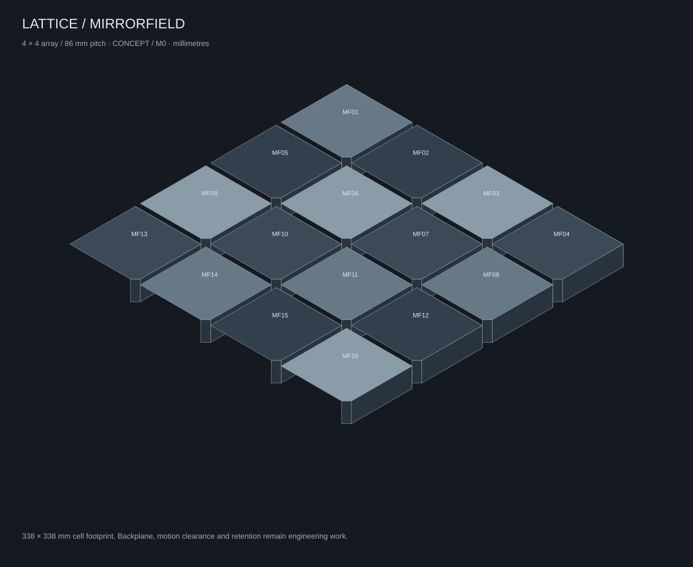

<p align="center">
  
</p>

<p align="center">
  <a href="docs/STATUS.md"></a>
  <a href="docs/VERIFICATION.md"></a>
  <a href="LICENSE"></a>
  <a href="https://theworker02.github.io/lattice/"></a>
</p>

<p align="center"><strong>MIRRORFIELD / 0.5</strong> · An experimental modular physical computing platform</p>

LATTICE explores a different kind of physical product: modules that sense the world, make local decisions, show what they are doing, and pass useful information to another device or piece of software. The first product direction is a mirror-scale Signal Cube, supported by a local simulator, a digital Twin, an engineering plan, and a manufacturer-facing M1 pilot program.

The central product is now the **LATTICE Signal Cube**: a cube-shaped sensor and signal hub that gathers readings, processes them locally and routes useful messages to other devices or software. The portal leads with its working local routing demo. [Product direction and implementation](docs/SIGNAL_CUBE.md). Its selected mirror-scale appearance is mapped to a proposed sensor-under-scales and central-hardware-core design in the [SC-A0 manufacturing brief](manufacturing/SIGNAL_CUBE_MANUFACTURING_PLAN.md).

**New to the project?** Begin with [Start Here](START_HERE.md). It explains the idea without requiring an engineering background, shows what is real today, and points manufacturers to the right pilot documents.

The official LATTICE mirrored-facet mark, wordmark, monochrome mark and favicon are in the [brand kit](brand/README.md). The website, Patchboard and GitHub Pages release all use the same official mark.

Try the cube by choosing a sensor and destination, applying the route, then sending samples or starting its one-second stream. Adjust the simulated reading or temporarily disable the destination to inspect buffering and expiry. This software demonstration has no physical sensor or external network connection. It runs independently of the MIRRORFIELD array below it.

LATTICE explores modular sensing, power, logic, communication and motion. MIRRORFIELD adds functional optical surfaces and a synchronized local simulation: light enters a surface, becomes measured energy, passes through logic, and activates a load. The Twin retains the evidence.

**Status:** software models are **SIMULATED**; physical designs are **CONCEPT**. No hardware is validated or connected. [Full maturity register](docs/STATUS.md).

## What LATTICE is trying to make

```text
Environment → sensor → local logic → typed signal → chosen destination
                  ↑                         ↓
          functional mirror skin      Twin / Observatory
```

A LATTICE object should expose its own computation. A person can see the surface, inspect the signal, trace a decision, and understand why a physical response occurred. The project treats appearance, optics, energy, mechanical construction, electronics, firmware and software as connected parts of the same machine.

The proposed Signal Cube demonstrates that idea in a small form. Most of its outer scales are reflective. Selected scales can be designed as light, photovoltaic or temperature cassettes. The main controller, protected power path, wired interface and diagnostics belong in the central core behind the dark middle band. The [SolarSkin diagrams](design/concepts/solarskin-stack.svg) explain why a mirror needs a real optical path before it can honestly be called a sensor or solar surface.

## What you can do today

| If you want to… | Start here |
| --- | --- |
| Understand the project without an engineering background | [Start Here](START_HERE.md) |
| Try the local Signal Cube and MIRRORFIELD simulation | [Run the portal](#run) |
| See how one sensor reading becomes a message | [Signal Cube specification](docs/SIGNAL_CUBE.md) |
| Evaluate the physical product as a manufacturer | [Manufacturer onboarding](docs/MANUFACTURER_ONBOARDING.md) |
| Review the first proposed build program | [M1 Pilot Program](manufacturing/M1-PILOT-PROGRAM.md) |
| Learn the vocabulary | [Plain-language glossary](docs/GLOSSARY.md) |
| Help improve the project | [Contribution guide](CONTRIBUTING.md) |

## The public promise

LATTICE will distinguish carefully between a concept, a simulation, an engineered drawing, a physical prototype and a validated result. A nice rendering, a good simulator, or a clean website does not prove an optical coating, power circuit, enclosure, sensor or product is ready to manufacture. That distinction is part of the product’s credibility.

## Manufacturing partnership

This repository is a collaboration package, not a production handoff. LATTICE supplies the product intent, visual direction, architecture, pilot plan and evidence requirements. A manufacturing partner would need to perform most of the practical work: detailed CAD, materials/coatings, electrical/PCB design, sourcing, fixtures, tooling, fabrication, test, quality systems and applicable certification. Read the full [manufacturing partnership note](MANUFACTURER_PARTNERSHIP.md) before treating any plan as a build request.

For a short manufacturing-specific introduction, read [Manufacturer Onboarding](docs/MANUFACTURER_ONBOARDING.md). Terms used across the repository are collected in the [plain-language glossary](docs/GLOSSARY.md).

## License and brand use

The source and documentation are available under the [MIT License](LICENSE), copyright © 2026 Magnexis and [@theworker02](https://github.com/theworker02). LATTICE, MIRRORFIELD, Magnexis and the mirrored-facet identity remain protected as project names and brand assets; read [Trademark and brand use](TRADEMARKS.md) before using them for another product or public identity.

## Project blueprint

LATTICE is organized as a build-and-evidence system, not only a web demonstrator. The repository has 19 source working areas, excluding the generated deployment bundle:

| Area | What it contains |
| --- | --- |
| `src/` | Local simulator, Twin, routing lab and portal behavior |
| `tests/` | Deterministic software behavior tests |
| `design/` | Industrial, optical, material, geometry and identity direction |
| `optical/` | Spectral and SolarSkin research boundaries |
| `manufacturing/` | SC-A0 plan, M1 pilot, BOM, RFQ, DVP, traveler and DFM artifacts |
| `docs/` | Architecture, protocols, power, safety, prototype and release decisions |
| `firmware/` | Safe boot, sampling, health and service requirements |
| `hardware/` | Central-core, cassette, power and harness integration rules |
| `protocols/` | Release boundary for identity, samples, commands, health and transport |
| `calibration/` | Measurement traceability and channel-specific calibration plans |
| `quality/` | Unit records, nonconformance and pilot learning metrics |
| `compliance/` | Claim boundaries and future safety/EMC/material review triggers |
| `simulator/` | Scenario library and simulated-versus-measured governance |
| `observatory/` | Local inspection surface and physical-pilot data requirements |
| `examples/` | Bounded physical integration briefs |
| `operations/` | Supervised pilot demonstration and data-stewardship rules |
| `schemas/` | Machine-readable module passport contract |
| `tools/` | CAD/artifact verification utilities |

Every physical folder begins at **CONCEPT** until it gains reviewed drawings, selected materials, identified assemblies and test evidence. The [M1 Pilot Program](manufacturing/M1-PILOT-PROGRAM.md) connects those areas into the first manufacturer-facing build.

## Run

Requirements: Python 3, Node.js 20+ for tests, and a current browser. No package installation, build step, account, network service or API key is required.

```powershell
python -m http.server 4173 --bind 127.0.0.1
```

Open [MIRRORFIELD Observatory](http://127.0.0.1:4173/mirrorfield.html). The [original editable patchboard](http://127.0.0.1:4173/index.html) remains available, including its existing local saves and v1 JSON format. Stop the server with Ctrl+C. Use HTTP on localhost; direct file loading does not reliably support native modules.

## GitHub Pages

The public portal is a static GitHub Pages site. It serves the website and public project documents; simulations remain in each visitor’s browser local storage. GitHub Pages publishes Mirrorfield at the repository root and keeps the original Patchboard at `/patchboard.html`. Read [GitHub Pages deployment](docs/GITHUB_PAGES.md) and the [public deployment checklist](docs/PUBLISH_CHECKLIST.md) before publishing. GitHub Pages must be enabled once in the repository settings by an administrator.

## From simulation to physical product

The project now has an explicit [physical realization plan](docs/REALIZATION_PLAN.md): a simulated CAN-FD discovery reference, E1 power/PCB/firmware handoff boundaries, a heliotropic-cell mechanism brief, SolarSkin coupon protocol, and an M1 cost/RFQ structure. It gives a manufacturer or engineering partner a sequence of evidence gates instead of asking them to infer missing work from a rendering.

## Contribution and governance

Changes to `main` are protected and reviewed through pull requests. The [contribution guide](CONTRIBUTING.md) explains how to participate; [repository governance](docs/REPOSITORY_GOVERNANCE.md) defines the evidence and review rules that keep public engineering claims trustworthy.

## Portal and guided experiments

The portal explains LATTICE and the light → collection → decision → motion workflow before the workbench. Module families use consistent colors alongside text labels. Select any module for a description of its role; detailed signal provenance remains available in an expandable trail.

Three experiment buttons load reproducible sunny, cloudy and highly reflective scenarios. They reset settings and runtime history while preserving module identities. Export first to keep a separate copy of your current settings. A live explanation describes why the motor is running, waiting for power, or stopped by protection. Engineering maturity labels remain in the documentation rather than the portal footer.

## Fault center and incident reports

The Fault center tab distinguishes active faults from normal waiting. Critical faults produce a persistent red banner and patterned module borders. Opening evidence records the module state, energy totals and reason at first detection. Repeated samples do not create duplicate incidents. Acknowledgement records that you reviewed a fault; it never clears the cause or authorizes motor power.

Run one of four fault drills, inspect the affected module, clear its injection, and re-arm the motor after a short or thermal trip. Replay shows the active incidents known at that recorded frame. Incident reports and full-run exports include the journal. Each run retains up to 200 incidents, discarding the oldest resolved entries first and preserving open incidents. Resetting, importing or loading an experiment clears the journal; export before replacing a run.

Operation errors in both workbenches remain visible until dismissed. This is a local simulated diagnostic workflow, not a hardware alarm or remote monitoring service.

## Explore MIRRORFIELD

The 4 × 4 virtual array contains SolarSkin, vector/temperature sensing, mirrored cells, energy controller, battery, logic, fusion, Bridge and motor. Adjust irradiance and sun direction, optical fractions, tracking, power threshold, delay and demand. Inspect the physical array in surface, thermal or power view.

- **Collection:** explicit reflection/transmission/absorption and bounded recapture; separate geometric ray experiment.
- **Energy:** bounded battery charge/discharge, load demand and lighting power accounting.
- **Control:** the same acyclic graph evaluator used by the patchboard, extended with an L2 power comparator.
- **Protection:** staged virtual negotiation, passport voltage/current checks, fail-safe OFF, priority arbitration and latched motor faults.
- **Twin:** health, causal signal IDs and parent references, 600 retained snapshots, event-to-frame inspection, scope overlays and run export.
- **Diagnostics:** simulated LatticeLight Manchester/CRC round trip and explicitly virtual Bridge loopback.

Try 900 W/m², tracking enabled, power above 1 W for 2 s and motor demand 1.2 W. After negotiation and the delay the motor runs if supply is sufficient. Inject a motor short: the motor switches off while collection continues. Clear the fault and re-arm. Scrub to the activation event to inspect its recorded causal chain.

Each configuration change is recorded. Threshold/delay edits restart rule timing; resetting the run restores configured initial battery charge and clears runtime faults/history. Replaying pauses execution and disables model edits. Return to live before editing. Histories are bounded and are not automatically saved across reloads.

Projects persist in browser local storage per origin. Import/export retains UUID identity and configuration; import replaces the current project and restarts simulation. Export first to keep a separate copy. Storage failures are reported; JSON export remains available. A recorded-run export contains the retained frame/event window and is intended for inspection, not project import.

## Verify and regenerate

```powershell
node --test tests/*.test.mjs
node --check src/mirrorfield-app.mjs
node --check src/twin.mjs
python tools/generate-cad.py
python tools/verify-artifacts.py
```

The software uses native ECMAScript modules and zero external runtime dependencies. Key modules: `engine.mjs` (shared graph evaluator), `optics.mjs` (energy/rays), `passport.mjs` (identity/power/priority), `twin.mjs` (simulation/recorder), and `latticelight.mjs` (diagnostics).

## Engineering package

- [Design language](LATTICE_DESIGN_LANGUAGE.md), [spectral research](optical/spectral-response.md), [SolarSkin budget](optical/solarskin.md).
- [Signal Cube manufacturing brief](manufacturing/SIGNAL_CUBE_MANUFACTURING_PLAN.md), [surface-to-core drawing](manufacturing/drawings/signal-cube-core.svg), [cube BOM framework](manufacturing/bom/signal-cube.csv), [manufacturing package](manufacturing/README.md).
- [M1 12-unit manufacturer pilot](manufacturing/M1-PILOT-PROGRAM.md), [supplier RFQ pack](manufacturing/suppliers/RFQ-SC-M1.md), [design verification plan](manufacturing/test-jigs/M1-DVP.md), [pilot traveler](manufacturing/assembly/SC-M1-TRAVELER.md), [DFM risk register](manufacturing/dfm/SC-A0-RISK-REGISTER.md).
- [Manufacturing partnership note](MANUFACTURER_PARTNERSHIP.md): the partner-led engineering and fabrication boundary for a GitHub reader.
- [M0 CAD](manufacturing/cad/mirrorfield-m0.scad) and [drawing](manufacturing/drawings/m0-envelope.svg) for the separate flat-array research fixture.
- [Engineering request](RFE-0001-MIRRORFIELD.md), [decisions](docs/decisions/EDR-001-CAN-vs-RS485.md), [prototype generations](docs/PROTOTYPES.md).
- [LatticeLink](docs/LATTICELINK.md), [LSP](docs/LSP.md), [power](docs/POWER_ARCHITECTURE.md), [safety](docs/SAFETY_ARCHITECTURE.md), [passport schema](schemas/module-passport.schema.json).
- [Twin architecture](docs/TWIN.md), [test plan](docs/TEST_PLAN.md), [verification](docs/VERIFICATION.md), [roadmap](docs/ROADMAP.md), [security](SECURITY.md).



## Current evidence boundary

The browser-local simulator, CAN-FD discovery reference, protocol tests and engineering package are implemented. The physical product remains partner-led: exact materials, boards, connector ratings, motion hardware, calibrated spectral channels, production CAD and commercial quotes need measured or supplier-controlled evidence before they can advance. [Realization plan](docs/REALIZATION_PLAN.md), [status register](docs/STATUS.md) and [verification record](docs/VERIFICATION.md) show the owner and acceptance gate for each item.

## License

**Source-available proprietary** — evaluation under [LICENSE](./LICENSE); commercial / production use via [COMMERCIAL.md](./COMMERCIAL.md). See [LICENSE_TRANSITION_NOTICE.md](./LICENSE_TRANSITION_NOTICE.md).


---

## License & acquisition

This project is **proprietary**. Production use, redistribution, and commercial deployment require a written commercial license or completed acquisition. See [LICENSE](./LICENSE) and [ACQUISITION.md](./ACQUISITION.md). Contact [@theworker02](https://github.com/theworker02).
