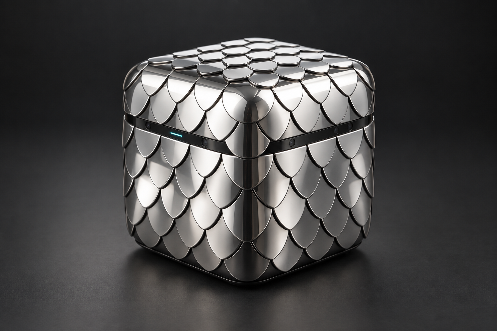

# LATTICE Signal Cube — mirror-scale manufacturing design brief

Revision SC-A0 · **CONCEPT — engineering design input, not production release**

## 1. Binding appearance reference

**This exact image is the user-selected exterior appearance reference.** Preserve its cube proportions, softened corners, overlapping shield-shaped mirror scales, staggered rows, narrow dark equatorial sensing band, discreet apertures, short cyan indicator and dark recessed base. Do not substitute a flat metal box, exposed electronics, ventilation grille or a different scale pattern. Use this same asset for manufacturer discussions and visual comparisons.

The image fixes design intent, not dimensions or unseen construction. Perspective, highlights and occluded scales cannot be converted into exact manufacturing geometry without a dimensioned model. Deviations needed for assembly, optical access or safety must be documented and approved before appearance freeze. The older flat M0 array is a separate research fixture; its CAD is **not** this product.

## 2. Central core: where the hardware goes

The dark middle band is the exposed perimeter of an **internal central chassis and service core**. It is not an empty decorative strip. The main hardware sits inside the cube, behind and attached to this chassis; it does not have to fit inside the visible strip's narrow height.

The central core contains:

- Main controller PCB: MCU, local memory, sensor-bus controller, watchdog and debug/programming interface.
- Protected input/power PCB: input protection, regulation, load switches, current/voltage monitoring and separately controllable sensor/indicator rails.
- Wired communication interface and connector support. USB is the proposed first host path; final PHY, connector and protocol require selection.
- Sensor interface connectors for short, replaceable flex tails from the surface cassettes.
- Band-mounted optical receiver/emitter and indicator PCB, behind separate apertures and optical baffles.
- Board-mounted temperature sensor and a chassis temperature probe.
- Mounting bosses, electrical insulation, thermal interfaces and service access.

Only the detector/PV elements that need direct proximity to a surface live under scales. Their small local boards or flex islands connect inward. Bulk computation, power conditioning and communications stay in the central core. No motor, fan or machinery is implied by the pictured cube.

For the first prototype use an external, constrained low-voltage source. A battery is optional future hardware, **not** packed into unspecified leftover space. A radio is also optional: do not conceal an antenna behind a continuous conductive mirror enclosure and assume it works.

## 3. Sensors beneath mirror scales

**Selected mirror scales must have sensing or photovoltaic elements beneath them.** A solid opaque mirror cannot illuminate a detector hidden directly behind it. Use one of the explicit optical constructions below, preserving the visible scale geometry.

| Cassette | Exterior | Directly underneath | Required function / evidence |
| --- | --- | --- | --- |
| S-L / light sensing | Partially transmitting mirror finish on a clear scale substrate, or a defined concealed optical inset | Black light well, photodiode/ambient-light sensor, small flex PCB | Measure incident light through that exact stack; calibrate its attenuation and angular response |
| S-P / solar collection | Partially reflecting, partially transmitting scale stack | PV coupon, insulated thermal backing, flex leads | Generate measurable electrical power; characterize R/T/A, I-V curve and operating temperature |
| S-I / infrared | Spectrally selected reflective/window region | IR receiver or detector with its own baffle | Match window transmission to emitter/receiver band; verify rejection and interference |
| S-T / surface temperature | Ordinary reflective scale, no optical transparency required | Electrically insulated bonded/contact temperature element | Measure scale temperature; characterize thermal lag and avoid conductive shorts |
| S-R / reflective-only | Opaque mirrored finish matching surrounding scales | Carrier and insulation only | Complete the exterior; not falsely counted as a sensor or solar collector |

An S-L light sensor measures illumination; an S-P photovoltaic element generates power. They are different parts and must be labeled separately in BOMs, firmware and UI. Do not claim every scale generates energy, or that the cube is self-powered. Non-optical sensing can work without a transparent window; light sensing cannot.

Proposed common stack, outside → inside:

1. Protective optical surface and safe finished scale edges.
2. Scale substrate with a specified partial reflector or local optical window for S-L/S-P/S-I.
3. Controlled air gap / black optical baffle; no neighboring scale may cover the required aperture.
4. Detector or PV coupon and its local substrate.
5. Electrical isolation and, for S-P/S-T, a characterized thermal interface.
6. Mechanically retained cassette/carrier with strain-relieved flex tail.
7. Connector at the central core, labeled with cassette location and function.

The visual concept does not select a coating. Use [spectral-response research](../optical/spectral-response.md) as a starting point and require finished-stack measurements before approving optical function.

## 4. Proposed internal allocation

These are **packaging study targets**, not released dimensions. They exist so an engineer can start a coherent layout and identify conflicts.

| Item | SC-A0 study allocation | Must be verified |
| --- | --- | --- |
| Outer cube | 120 × 120 × 120 mm nominal envelope | Appearance proportions, touch/edge safety and usable internal volume |
| Central internal volume | 96 × 96 × 96 mm maximum allocation | Shell, corners, carrier, connector access and insulation reduce usable space |
| Main controller PCB | Up to 82 × 82 mm | Mounting holes, routing, components, interface clearance |
| Power/interface PCB | Up to 82 × 60 mm below controller | Thermal and electrical clearances, connector insertion loads |
| Exposed middle band | Approximately 14 mm visible height; placement matched to image | Exact position derived in reviewed exterior CAD, not inferred from pixels |
| Surface stack allowance | Nominal 8–12 mm outside central allocation | Scale overlap, optical gap, detector/PV thickness and corner transitions |

These allocations overlap at transitions and require a full interference study. They do not establish wall thickness, contact ratings, tolerances, optical flatness or fastener lengths. No cut files or toolpaths should be produced from this table alone.

## 5. Surface assignment for the first sensing prototype

Start with **three S-L cassettes** (top and two adjacent faces) for relative light comparison, **one S-P coupon** on the top face for collection research, and **two S-T cassettes** (one near the PV region, one shaded face). Other visible positions use S-R mirrors. Add S-I only after its optical band is selected. Aperture size and exact scale counts remain CAD-controlled; the rendering must not be treated as a reliable count of hidden pieces.

Use stable location IDs such as TOP-L01, FRONT-L01, RIGHT-L01, TOP-P01, TOP-T01 and LEFT-T01. A passport maps each to its channel, units, calibration record, board revision and core connector. Several directional readings do not automatically provide a calibrated sun vector; test the assembled angular response first.

## 6. Electrical and mechanical connections

Sensor flex cables route behind the scale carrier into labeled core connectors, with controlled bend radii and strain relief. Local analog traces should be short; shared digital buses require address and wiring validation. PV leads go to a **dedicated power-conditioning input**, never a general sensor input. Temperature elements connect to the appropriate measurement circuit, with electrical insulation from conductive scales.

The sensor band has separately baffled receive and transmit apertures; the status light must not flood its receiver or surface detectors. Main power and signal connectors are recessed in a serviceable underside pocket supported by the core. Their final position and ratings are pending engineering. No magnets or mirror scales serve as load-bearing electrical contacts.

Prefer captive mechanical scale retainers on removable face carriers. Adhesives may support optics only after aging and rework review; do not depend on an unspecified glue layer as the sole retention design. Corner scales need their own geometry. Conceal assembly fasteners at the base or beneath removable carriers without making the entire cube disposable.

## 7. Assembly and inspection sequence

1. Approve a dimensioned exterior model against the exact appearance reference, including all six faces and corners.
2. Build a non-powered shell/core mockup. Check scale overlap, service access, connector reach and detector/PV aperture clearance.
3. Test S-L/S-P/S-T coupons outside the enclosure. Record material and optical-stack identity.
4. Assemble and inspect the core boards separately; verify protected rails and communication before adding surface modules.
5. Install electrically insulated thermal interfaces and the band board. Check emitter/receiver optical separation.
6. Connect each cassette individually, identify its channel and confirm readings. Do not install uncharacterized PV directly on a bus rail.
7. Install carrier panels and scales in the documented row order. Photograph aperture access before closure.
8. Calibrate with the full shell assembled. Test tilt/illumination angle, self-heating, shadowing, indicator interference and packet delivery.
9. Record serials, firmware, calibration and as-built deviations. Re-open and reassemble once to validate serviceability.

## 8. Required release evidence

Deliver actual CAD/STEP and dimensioned drawings, selected materials/coatings, measured finished-stack spectral data, reviewed schematics and PCB files, BOM variants, protection calculations, assembly fixtures and test procedures. Test electrical isolation, operating temperatures, optical cross-talk, retention, sharp edges, durability and signal freshness. Cosmetic approval and simulation tests do not qualify a physical assembly.

**Current release boundary:** exact exterior reference plus a detailed proposed internal architecture. No fabricated hardware, manufacturing-ready CAD, final circuit, validated optical stack or production authorization is claimed.
